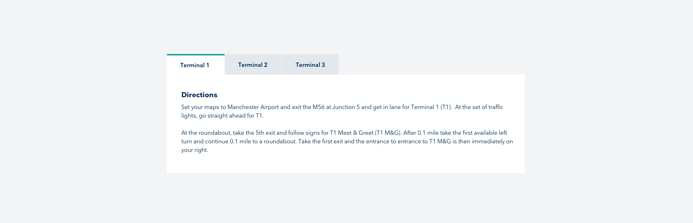

# Tab interview task

## Intro
Your client within your team has requested a tab component for their site. The work was approved and handed to the team designer, who has created a design for large screens in Sketch however they haven't done anything for small screens. They have now gone on holiday with the work unfinished and you have the task to complete the work.

## Component Considerations
- The tab component is to be managed by the client
- The client will be inserting it on the pages via their CMS
- It is a global website that has a broad range of customers

## Task Considerations
Develop the tab component however you feel it should be developed, using the technique you feel is most appropriate. There are a couple of requirements from us:

- If you use scripting please only use vanilla JavaScript
- Please don't use any frameworks when building the tabs
- Please host the code in a repository (GitHub, ButBucket, etc), it's advised to commit often so that we can see how your solution evolves.
- You don't need to spend a long time on this, timebox yourself to no more than an hour.
- Focus on what you percieve to be the most important aspects first.

## Designs
The designer has got to this point with the component which is [available in a Sketch file](tab-component.sketch) or [on SKtech cloud](https://sketch.cloud/s/zbprM), for the purposes of this task don't worry about matching the font.

## Acceptance criteria:

The following acceptance criteria have been developed between the team and the client.

**Given:** I am a site user
**When:** I click on a tab
**Then:** Then the related block should be shown
**And:** Any other open tabs should be closed

**Given:** I am a site user
**When:** I click on a tab
**Then:** That tab should be marked as active

**Given:** I am a site user
**When:** I view the component
**Then:** I want it to render appropriately on whatever device I am currently using

**Given:** I am a site author
**When:** I add the component to the page
**Then:** I want to be able to add as many tabs as i require

## Approach

Given the time constraints I tried to approach the task with simplicity in mind whilst offering a functional, responsive, accessible tab component in the alloted time.

I began by creating semantic markup for the tab component; adding appropriate WAI-ARIA states, roles and properties where necessary. I added basic CSS for the layout. I did not utilise SASS or other preprocessors for this task as I believed it would be overkill here.

I made the layout resposive; utilising rem sizing and flexbox and added a mobile breakpoint media query to handle a tabbed interface on smaller devices. I reconfigured the content into a single column where there was insufficinet room to layout addional tabs horizontally.

Testing for this scenario was manual given the time constraints. Typically I would employ unit, integration and e2e testing (although not _usually_ with vanilla JavaScript!) I tested using right-to-left text direction to account for global audiences.

I also tested cross browser (Chrome, Safari and Firefox). I do not believe this is compatible with IE as I have utilised some JavaScript ES6 methods (these could be transpiled if I added a Babel build config given more time).

Further testing on simulation devices was carried out using Chrome dev tools to check mobile layout and functionality. Screen reader functionality was tested on Safari using VoiceOver.
